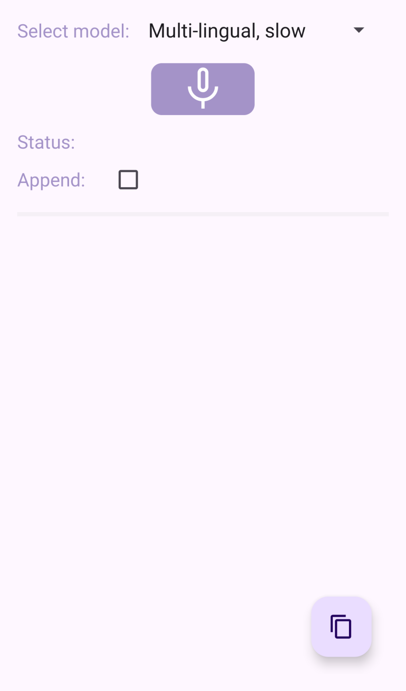
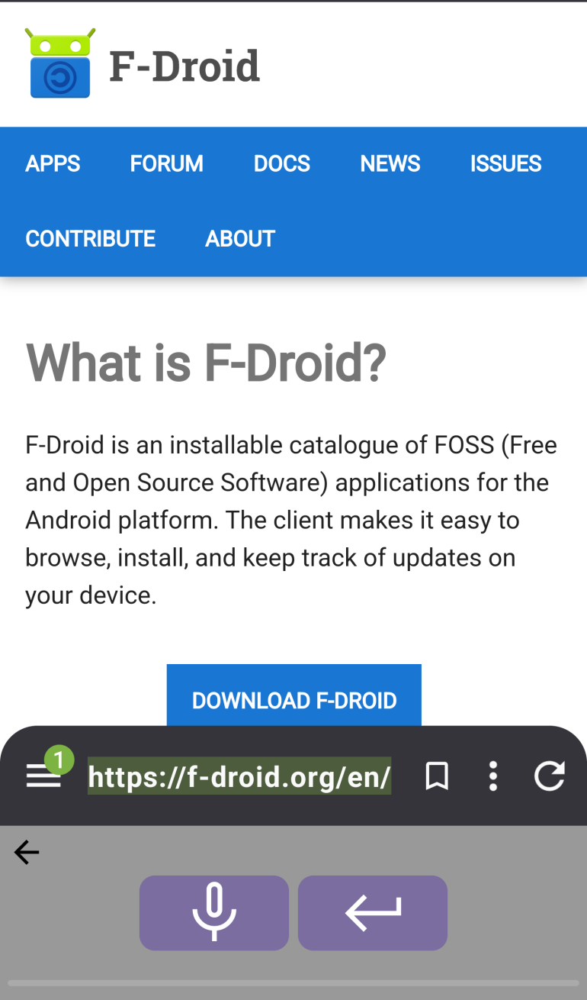

## Donate
<pre>Send a coffee to 
woheller69@t-online.de 

  
Or via this link (with fees)
</pre>
# Voice recognition based on Whisper

 

Whisper is an input method editor (IME) that leverages voice recognition technology based on the Whisper engine. 
It offers a seamless user experience, functioning both as a standalone application and an integrated IME that can be activated, e.g. via the microphone button in HeliBoard.
As a standalone app Whisper can also translate any supported language to English.

## Initial Setup

Upon launching Whisper for the first time, the app will download the necessary Whisper models from Hugging Face. 
Please note that this is the only instance where internet permission is required. 
Once the models are downloaded, voice recognition works entirely offline, ensuring your privacy and convenience.

## Model Selection

Whisper offers two models to choose from: a compact English-only model that prioritizes speed and a more comprehensive multi-lingual model that, while much slower, 
supports a broader range of languages. Select your preferred model within the app, and it will be applied consistently across all uses, including when used as an IME.

## Using Whisper

To get the most out of Whisper, follow these simple tips:

- Press and hold the button while speaking 
- Pause briefly before starting to speak
- Speak clearly, loudly, and at a moderate pace
- Please note that there is a limit of 30s for each recording

By following these guidelines, you'll be able to enjoy accurate and efficient voice recognition with Whisper.

## Contribute

For translations use https://toolate.othing.xyz/projects/whisperime/

# License
This work is licensed under MIT license, © woheller69

- This app is built on the [Whisper-Android project](https://github.com/vilassn/whisper_android), and [OpenAI Whisper](https://github.com/openai/whisper) published under MIT license
- At first start it downloads the Whisper TFLite models from [Hugging Face](https://huggingface.co/DocWolle/whisper_tflite_models), which is published under MIT license

# OTHER APPS

| **RadarWeather** | **Gas Prices** | **Smart Eggtimer** |
|:---:|:---:|:--:|
|  |  |  |
| **Bubble** | **hEARtest** | **GPS Cockpit** |
|  |  |  |
| **Audio Analyzer** | **LavSeeker** | **TimeLapseCam** |
|  | |  |
| **Arity** | **Cirrus** | **solXpect** |
|  |  |  |
| **gptAssist** | **dumpSeeker** | **huggingAssist** |
|  |  |  |
| **FREE Browser** | **whoBIRD** | **PeakOrama** |
|  |  |  |
| **Whisper** | **Seamless** | **SherpaTTS** |
|  |  |  |
