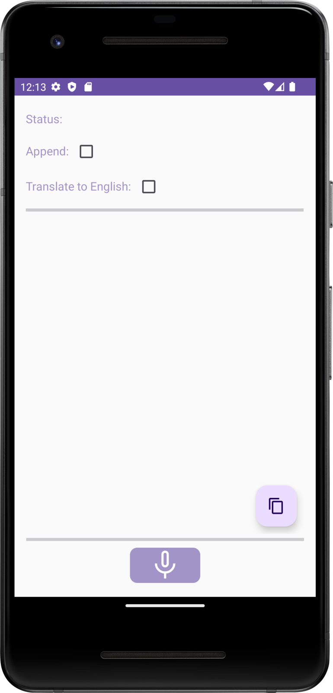

 ```
Google has announced that, starting in 2026/2027, all apps on certified Android devices
will require the developer to submit personal identity details directly to Google.
Since the developers of this app do not agree to this requirement, this app will no longer 
work on certified Android devices after that time.
```

## Donate
<pre>Send a coffee to 
woheller69@t-online.de 
<a href= "https://www.paypal.com/signin"></a>

  
Or via this link (with fees)
<a href="https://www.paypal.com/donate?hosted_button_id=XVXQ54LBLZ4AA"></a></pre>
# Fast Voice recognition based on Whisper

 

Whisper+ is an input method editor (IME) that leverages voice recognition technology based on the Whisper engine. 
It offers a seamless user experience, functioning both as a standalone application and an integrated IME that can be activated, e.g. via the microphone button in HeliBoard.
As a standalone app Whisper+ can also translate any supported language to English.

Besides providing an IME, Whisper+ can also be selected as system-wide voice input (RecognitionService) and it supports calls via intent (RecognizerIntent.ACTION_RECOGNIZE_SPEECH).

## Initial Setup

Upon launching Whisper+ for the first time, you will need to download the Whisper model from Hugging Face and install it. 
Voice recognition works entirely offline, ensuring your privacy and convenience.

Please note that for use as voice input (not as IME) there is a separate settings activity which can be accessed from Android settings 
(System > Languages > Speech > Voice Input). There you can activate the app as voice input and then click the settings button.

If after installation you do not find Whisper+ as voice input or only see a limited list (hard-coded ones like Google/Samsung)
- enable USB debugging
- type adb shell settings put secure voice_recognition_service org.woheller69.whisperplus/com.whisperonnx.WhisperRecognitionService

## Using Whisper+

To get the most out of Whisper+, follow these simple tips:

- Press and hold the button while speaking or use automatic mode where available
- Pause briefly before starting to speak
- Speak clearly, loudly, and at a moderate pace
- Please note that there is a limit of 30s for each recording

By following these guidelines, you'll be able to enjoy accurate and efficient voice recognition with Whisper.

[](https://f-droid.org/de/packages/org.woheller69.whisperplus/)

# License
This work is licensed under GPLv3 license, © woheller69
- This app is based on [whisperIME](https://github.com/woheller69/whisperIME), which is published under MIT license
- It uses code and the Whisper ONNX models from [RTranslator](https://github.com/niedev/RTranslator)
- It uses code from [Whisper-Android project](https://github.com/vilassn/whisper_android), published under MIT license
- It uses [OpenAI Whisper](https://github.com/openai/whisper) published under MIT license. Details on Whisper are found [here](https://arxiv.org/abs/2212.04356).
- It uses [Android VAD](https://github.com/gkonovalov/android-vad), which is published under MIT license
- It uses [Opencc4j](https://github.com/houbb/opencc4j), for Chinese conversions, published under Apache-2.0 license
- At first start you need to download the Whisper model from [HuggingFace](https://huggingface.co/DocWolle/whisperOnnx), which is published under MIT license

# OTHER APPS

| **RadarWeather** | **Gas Prices** | **Smart Eggtimer** |
|:---:|:---:|:--:|
| [](https://f-droid.org/packages/org.woheller69.weather/) | [](https://f-droid.org/packages/org.woheller69.spritpreise/) | [](https://f-droid.org/packages/org.woheller69.eggtimer/) |
| **Bubble** | **hEARtest** | **GPS Cockpit** |
| [](https://f-droid.org/packages/org.woheller69.level/) | [](https://f-droid.org/packages/org.woheller69.audiometry/) | [](https://f-droid.org/packages/org.woheller69.gpscockpit/) |
| **Audio Analyzer** | **LavSeeker** | **TimeLapseCam** |
| [](https://f-droid.org/packages/org.woheller69.audio_analyzer_for_android/) |[](https://f-droid.org/packages/org.woheller69.lavatories/) | [](https://f-droid.org/packages/org.woheller69.TimeLapseCam/) |
| **Arity** | **Cirrus** | **solXpect** |
| [](https://f-droid.org/packages/org.woheller69.arity/) | [](https://f-droid.org/packages/org.woheller69.omweather/) | [](https://f-droid.org/packages/org.woheller69.solxpect/) |
| **gptAssist** | **dumpSeeker** | **huggingAssist** |
| [](https://f-droid.org/packages/org.woheller69.gptassist/) | [](https://f-droid.org/packages/org.woheller69.dumpseeker/) | [](https://f-droid.org/packages/org.woheller69.hugassist/) |
| **FREE Browser** | **whoBIRD** | **PeakOrama** |
| [](https://f-droid.org/packages/org.woheller69.browser/) | [](https://f-droid.org/packages/org.woheller69.whobird/) | [](https://f-droid.org/packages/org.woheller69.PeakOrama/) |
| **Whisper** | **Seamless** | **SherpaTTS** |
| [](https://f-droid.org/packages/org.woheller69.whisper/) | [](https://f-droid.org/packages/org.woheller69.seemless/) | [](https://f-droid.org/packages/org.woheller69.ttsengine/) |
